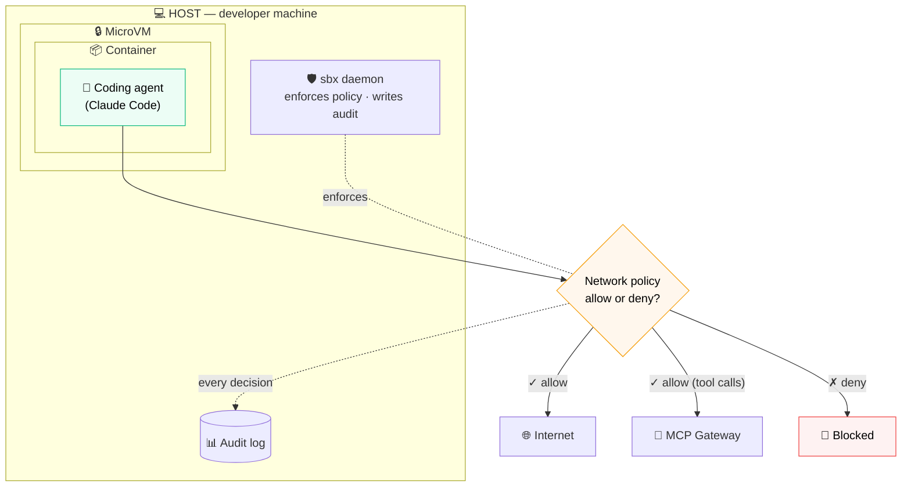
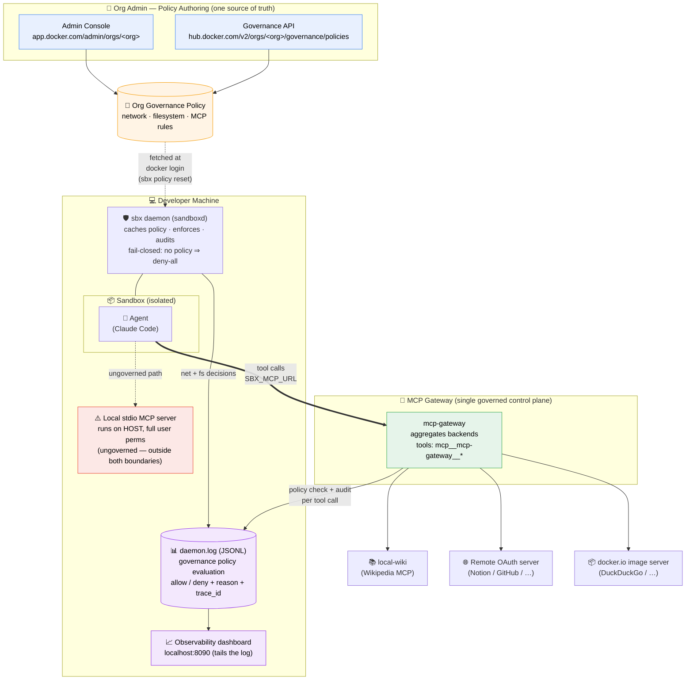
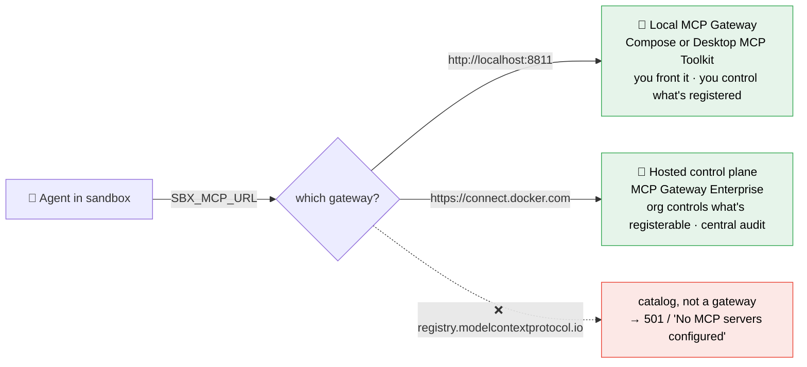

# AI Governance — Overall Architecture

How a single org policy, authored once, is enforced across the sandbox **and**
every MCP tool call — with every decision landing in one audit/visibility stream.

## At a glance

The coding agent runs in a **container inside a MicroVM** on your host. Every
network request passes through the **network policy** (allow or deny); each
decision is audited.

## The full picture

Where the policy comes from, and how MCP tool calls are governed and audited:

## How to read it

1. **Author once.** An org admin writes policy in the Admin Console UI or via the
   Governance API — both land in the same org policy (network, filesystem, MCP rules).
2. **Propagate.** On `docker login` with org credentials, the `sbx` daemon fetches
   and caches that policy (`sbx policy reset` forces a refresh).
3. **Enforce in two places, from the same policy:**
   - **Sandbox runtime** — the daemon checks every **network** and **filesystem**
     action at the boundary. Fail-closed: no policy loaded ⇒ everything denied.
   - **MCP Gateway** — every **tool call** the agent makes flows through one
     `mcp-gateway` endpoint (set by `SBX_MCP_URL`), where MCP policy applies.
4. **Audit everything.** Each decision is written to `daemon.log` as a structured
   JSONL `governance policy evaluation` record (allow/deny, reason, `trace_id`),
   which the observability dashboard tails live.

## The two gateway choices (`SBX_MCP_URL`)

| | Local gateway | `connect.docker.com` |
|---|---|---|
| `SBX_MCP_URL` | `http://localhost:8811` | `https://connect.docker.com` |
| Who runs it | You (Compose / Desktop) | Docker (hosted) |
| Governs | what *you* register | what your org *allows* (policy enforced) |
| Central audit | local log only | org audit trail |
| Best for | learning the mechanics | the real governance story |

> **Not a gateway:** `registry.modelcontextprotocol.io` is a discovery *catalog*.
> Pointing `SBX_MCP_URL` at it unlocks the `sbx mcp` CLI but cannot provision a
> gateway — attach fails with `501` / "No MCP servers configured."

## The key insight

The agent never talks to individual MCP servers — it talks to **one aggregated
`mcp-gateway`** endpoint, with every backend's tools namespaced
`mcp__mcp-gateway__<tool>`. That single chokepoint is where MCP governance and
audit happen. **Local stdio servers are the exception**: they run on the host,
outside both the sandbox boundary and the gateway — convenient, but ungoverned.
